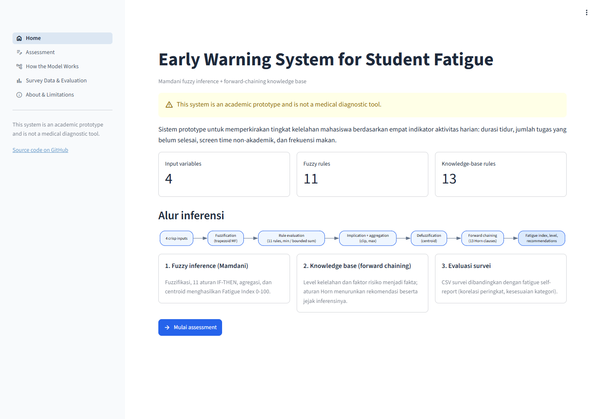
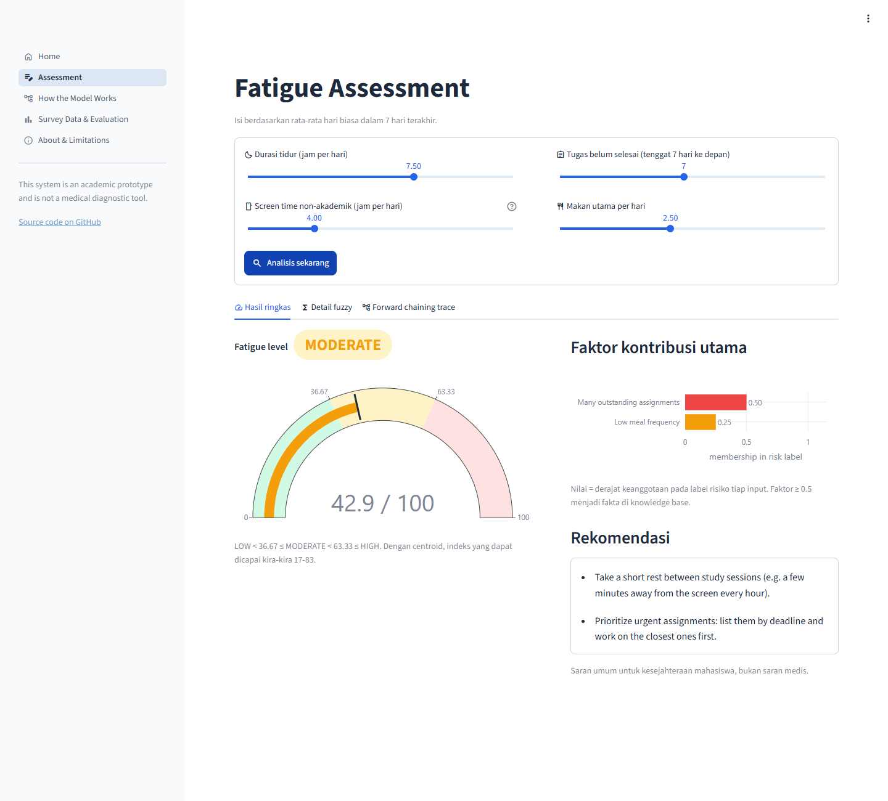
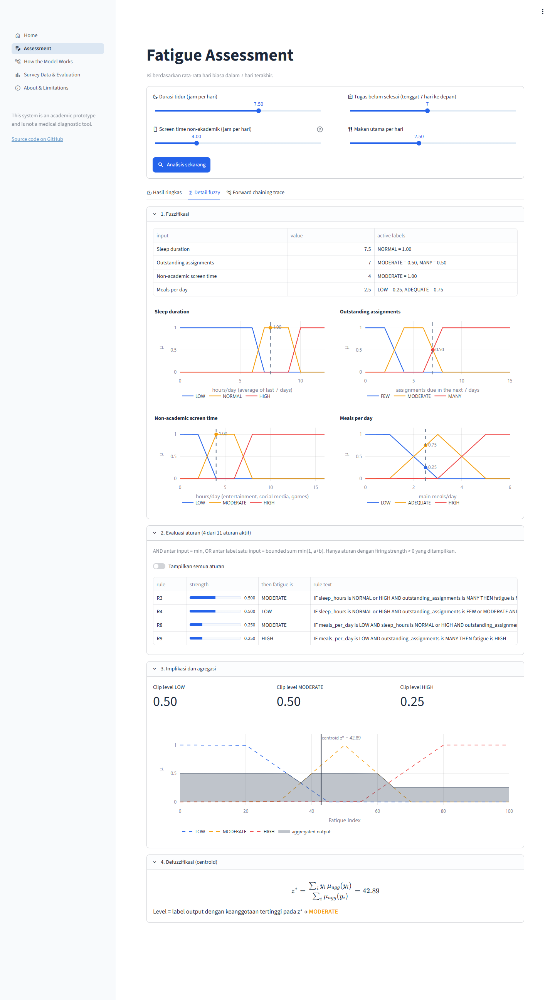
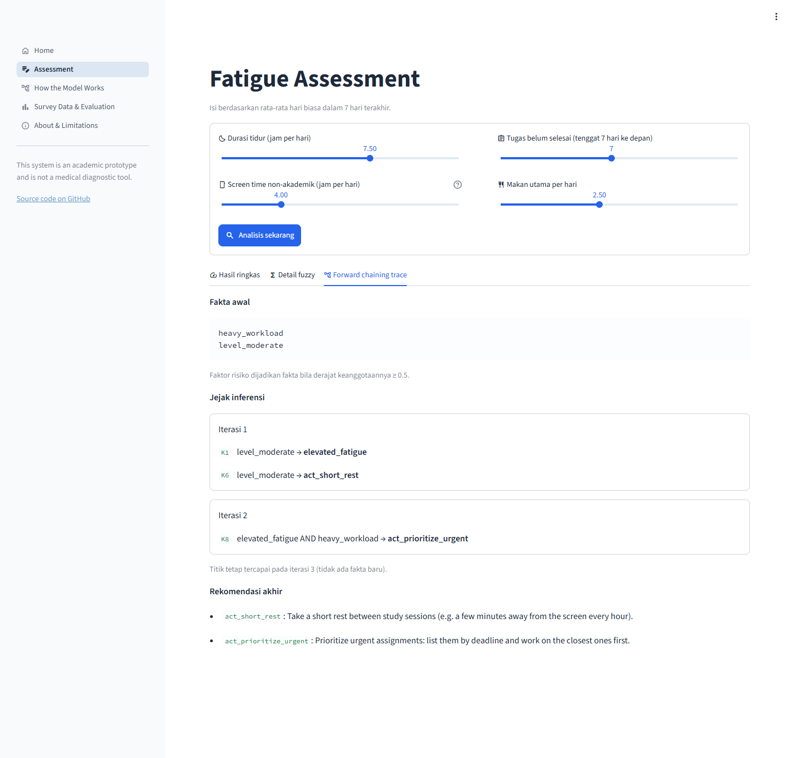
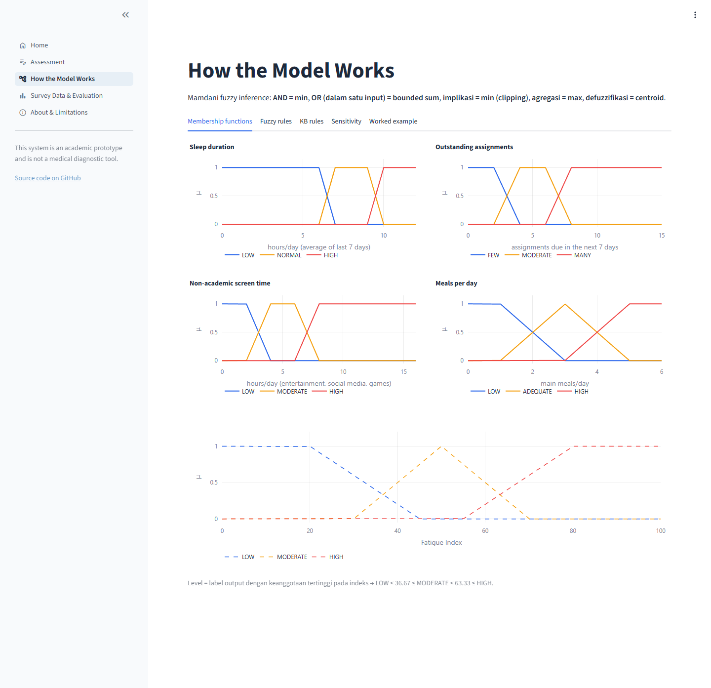
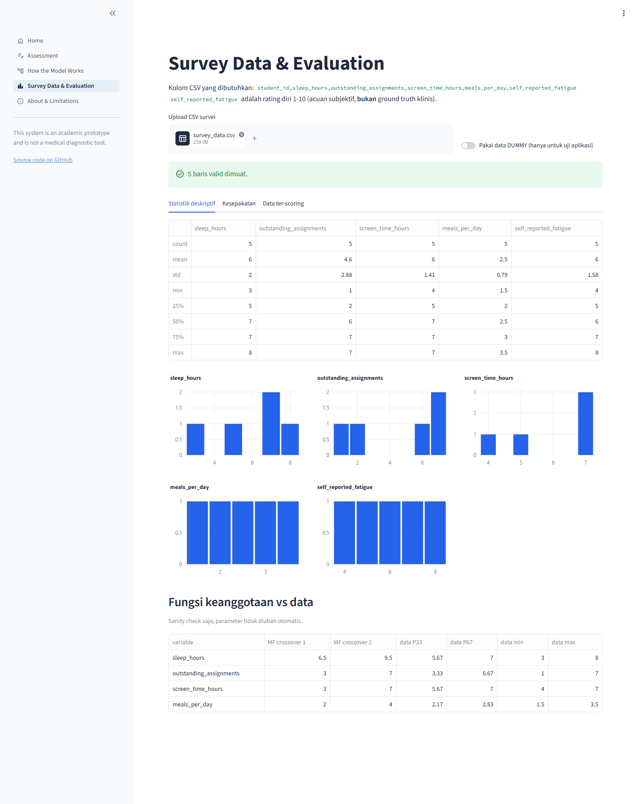
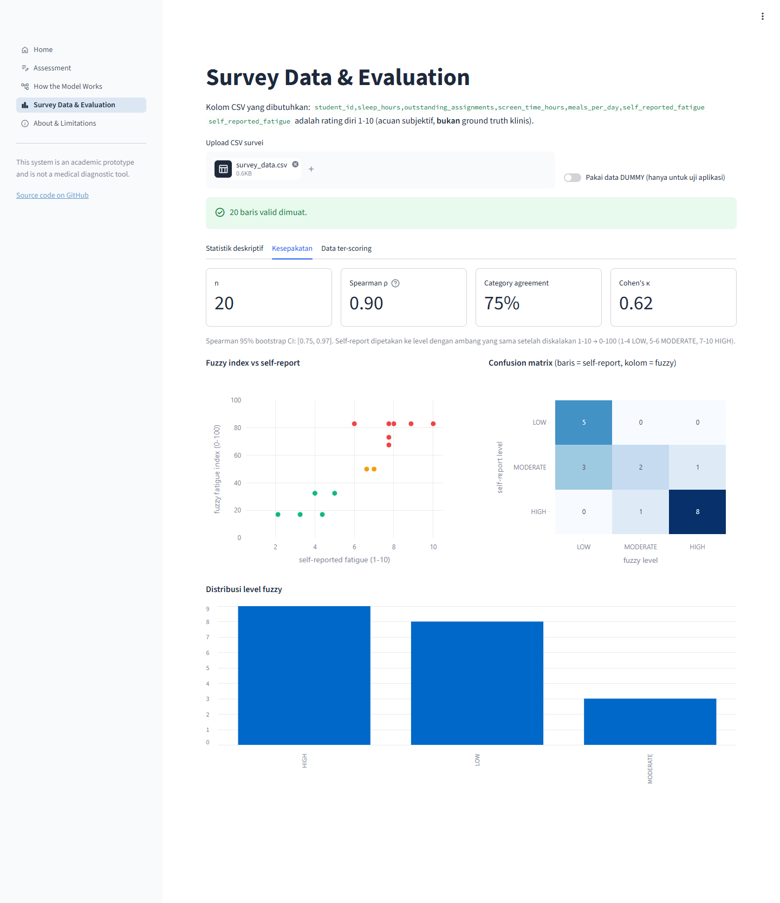
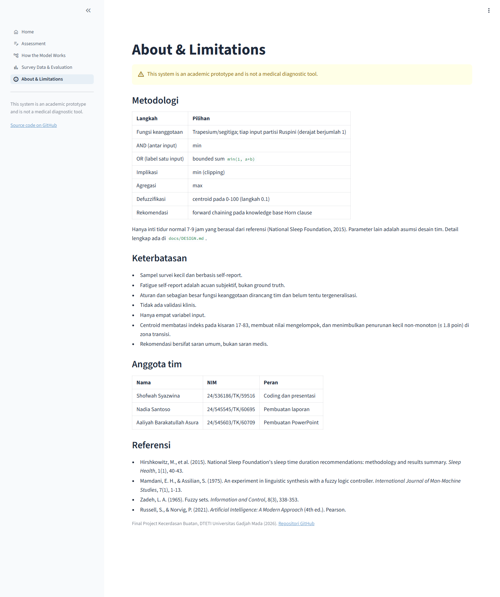

# Fuzzy-Based Early Warning System for Student Fatigue

> **This system is an academic prototype and is not a medical diagnostic tool.**
> Final Project — Artificial Intelligence, DTETI Universitas Gadjah Mada (2026).

**Live demo:** https://student-fatigue-fuzzy.streamlit.app/ (hosted on Streamlit Community Cloud; if the app has been idle it may take a minute to wake up)

## Project overview

A small web app that estimates a student's **Fatigue Index (0–100)** from four daily-habit indicators and suggests general well-being actions. It combines two AI techniques:

1. **Mamdani fuzzy inference system**, implemented from scratch in NumPy. Every step (fuzzification, rule evaluation, implication, aggregation, centroid defuzzification) is a separate, testable function.
2. **Knowledge-based recommendation layer**: a propositional Horn-clause knowledge base evaluated with **forward chaining**, with a step-by-step inference trace.

Real student survey data is used to **evaluate** the model (does the fuzzy index agree with self-reported fatigue?), not to train it.

## Problem

Students often notice fatigue only after short sleep, piling assignments, heavy entertainment screen time and skipped meals have already built up. These indicators are vague ("is 6.5 hours of sleep too little?"), which suits fuzzy sets better than hard thresholds.

## Features

- Multi-page app: Home, Assessment, How the Model Works, Survey Data & Evaluation, About & Limitations
- Assessment page with sliders; results in three tabs: summary (gauge, contributing factors, recommendations), fuzzy detail (membership degrees, fired rules with strengths, aggregated output set with centroid) and forward-chaining trace per iteration
- "How the Model Works" page: all membership functions, the 11 fuzzy rules with reasons, the 13 knowledge-base rules, a sensitivity chart and the worked example computed live
- "Survey Data & Evaluation" page: CSV upload, validation, descriptive statistics, input distributions, Spearman correlation with bootstrap CI, category agreement, Cohen's kappa, confusion matrix, download of scored data
- Runs locally or on the live demo. No database, login or external API.

## Fuzzy logic methodology

| Step | Choice |
|---|---|
| Membership functions | Trapezoid/triangle; each input is a Ruspini partition (degrees sum to 1) |
| AND (between inputs) | min |
| OR (labels of one input) | bounded sum `min(1, a+b)`, which equals "NOT the other label" on a Ruspini partition |
| Implication | min (clipping) |
| Aggregation | max |
| Defuzzification | centroid on 0–100 (step 0.1) |
| Level | output label with highest membership at the index → LOW < 36.67 ≤ MODERATE < 63.33 ≤ HIGH |

Rule base (11 rules): a sleep × workload base table (R1–R4), where LOW requires all four indicators to be fine, plus escalation rules for high screen time and low meal frequency (R5–R11). Full design, parameter sources and a hand-worked example are in [`docs/DESIGN.md`](docs/DESIGN.md).

Parameter sources are labelled **[REFERENCE-DERIVED]**, **[DATA-DERIVED]** or **[DESIGN ASSUMPTION]** in `fuzzy_model.py` and the design document. Only the 7–9 h "normal sleep" core is reference-derived (National Sleep Foundation, 2015). All other parameters are team design assumptions.

## Inputs

| Input | Meaning | Model range |
|---|---|---|
| Sleep duration | average hours/day, last 7 days | 0–12 |
| Outstanding assignments | unfinished assignments due in the next 7 days | 0–15 |
| Non-academic screen time | average hours/day of entertainment, social media, games | 0–16 |
| Meals per day | average number of main meals | 0–6 |

Values outside the range are clipped to the nearest bound.

## Outputs

- **Fatigue Index**: 0–100. With centroid defuzzification the reachable range is about 17–83.
- **Fatigue Level**: LOW / MODERATE / HIGH
- **Main contributing factors**: membership in each input's risk label
- **Recommended actions**: from forward chaining, for example *maintain routine, take a short rest, reduce non-essential activities, prioritize urgent assignments, consider a deadline extension, seek additional support if the pattern persists*

## Dataset

- `data/survey_data.csv`: real survey responses from students, anonymised as `R01`–`R05` (n = 5). The `group` column keeps the respondent's study-program/cohort code as written in the survey.
- `data/dummy_survey_data.csv`: **DUMMY DATA**, 15 rows written by hand only to test the app. Not collected from students, not a research result. The app shows a red warning when this data is loaded.
- `data/survey_template.csv`: header for the real survey export.
- Column definitions and the matching survey questions: [`data/README.md`](data/README.md).

Evaluation on `data/survey_data.csv` (n = 5): Spearman ρ = 0.79 (95% bootstrap CI −0.30 to 1.00), category agreement 40% (2 of 5), Cohen's κ = 0.12, MAE between the fuzzy index and the rescaled self-report = 12.4 points. With five respondents the confidence interval is very wide, so these numbers only show that the pipeline works; they are not evidence that the model is valid.

## Screenshots

**Home**



**Assessment: summary** (worked example input: sleep 7.5 h, 7 assignments, 4 h screen time, 2.5 meals/day → index 42.9, MODERATE)



**Assessment: fuzzy detail** (membership degrees, fired rules, aggregated output set and centroid)



**Assessment: forward-chaining trace**



**How the Model Works** (membership functions)



**Survey Data & Evaluation: descriptive statistics** (`data/survey_data.csv`, n = 5)



**Survey Data & Evaluation: agreement with self-reported fatigue**



**About & Limitations**



## Project structure

```
├── app.py               Streamlit entry point and page navigation
├── pages/               UI pages: home, assessment, model, survey, about
├── components/          Plotly charts and shared UI helpers
├── .streamlit/          theme (config.toml)
├── fuzzy_model.py       Mamdani fuzzy inference (algorithmic core)
├── recommendation.py    forward-chaining knowledge base (algorithmic core)
├── evaluation.py        survey validation, agreement statistics, sensitivity, monotonicity
├── run_test_cases.py    prints the scenario test table from the real model
├── make_figures.py      exports figures for the report to docs/figures/
├── tests/test_model.py  unit tests
├── data/                dummy data, template, column definitions
├── docs/DESIGN.md       full design document (Indonesian)
└── screenshots/         app screenshots
```

## Installation

Requires Python 3.9+.

```bash
git clone https://github.com/teacyzngi/Fuzzy-Based-Early-Warning-System-for-Student-Fatigue.git
cd Fuzzy-Based-Early-Warning-System-for-Student-Fatigue
python -m venv .venv
```

Activate the virtual environment:

| Shell | Command |
|---|---|
| Windows PowerShell | `.venv\Scripts\Activate.ps1` |
| Windows Command Prompt | `.venv\Scripts\activate.bat` |
| Git Bash (Windows) | `source .venv/Scripts/activate` |
| macOS / Linux | `source .venv/bin/activate` |

Then install the dependencies:

```bash
pip install -r requirements.txt
```

If PowerShell blocks the activation script, skip activation and call the venv's Python directly, e.g. `.venv\Scripts\python -m pip install -r requirements.txt` and `.venv\Scripts\python -m streamlit run app.py`.

## Running

With the virtual environment active:

```bash
streamlit run app.py          # web app, opens http://localhost:8501
python -m pytest -q           # unit tests
python run_test_cases.py      # scenario test table
python fuzzy_model.py         # prints the worked example in the terminal
```

## Example

Input: sleep 7.5 h, 7 outstanding assignments, 4 h non-academic screen time, 2.5 meals/day

| Step | Result |
|---|---|
| Fuzzification | sleep NORMAL = 1; assignments MODERATE = 0.5, MANY = 0.5; screen MODERATE = 1; meals LOW = 0.25, ADEQUATE = 0.75 |
| Fired rules | R3 = 0.50 → MODERATE, R4 = 0.50 → LOW, R8 = 0.25 → MODERATE, R9 = 0.25 → HIGH |
| Aggregation | LOW 0.50, MODERATE 0.50, HIGH 0.25 |
| Centroid | **42.89** → **MODERATE** |
| Recommendation | take a short rest; prioritize urgent assignments |

## Limitations

Small, self-reported survey sample; self-reported fatigue is a subjective reference, not ground truth; rules and most membership functions are designed by the team and may not generalise; no clinical validation; only four input variables; centroid limits the index to about 17–83, clusters values, and shows small (≤ 1.8 point) non-monotonic dips in transition zones; recommendations are general advice, not medical advice. See `docs/DESIGN.md` Part 15.

## Team members

| Name | NIM | Role |
|---|---|---|
| Shofwah Syazwina | 24/536186/TK/59516 | Coding and presentation |
| Nadia Santoso | 24/545545/TK/60695 | Report making |
| Aaliyah Barakatullah Asura | 24/545603/TK/60709 | PowerPoint making |

## Citation

- Hirshkowitz, M., et al. (2015). National Sleep Foundation's sleep time duration recommendations: methodology and results summary. *Sleep Health*, 1(1), 40–43.
- Mamdani, E. H., & Assilian, S. (1975). An experiment in linguistic synthesis with a fuzzy logic controller. *International Journal of Man-Machine Studies*, 7(1), 1–13.
- Zadeh, L. A. (1965). Fuzzy sets. *Information and Control*, 8(3), 338–353.
- Russell, S., & Norvig, P. (2021). *Artificial Intelligence: A Modern Approach* (4th ed.). Pearson.

The problem formalization, rule base and parameter choices were reviewed and are defended by the team.
